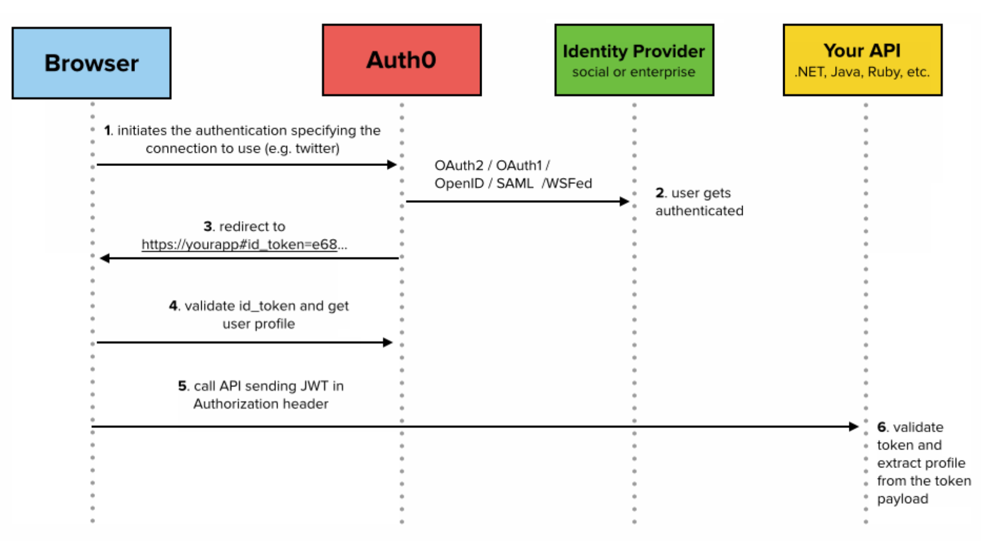
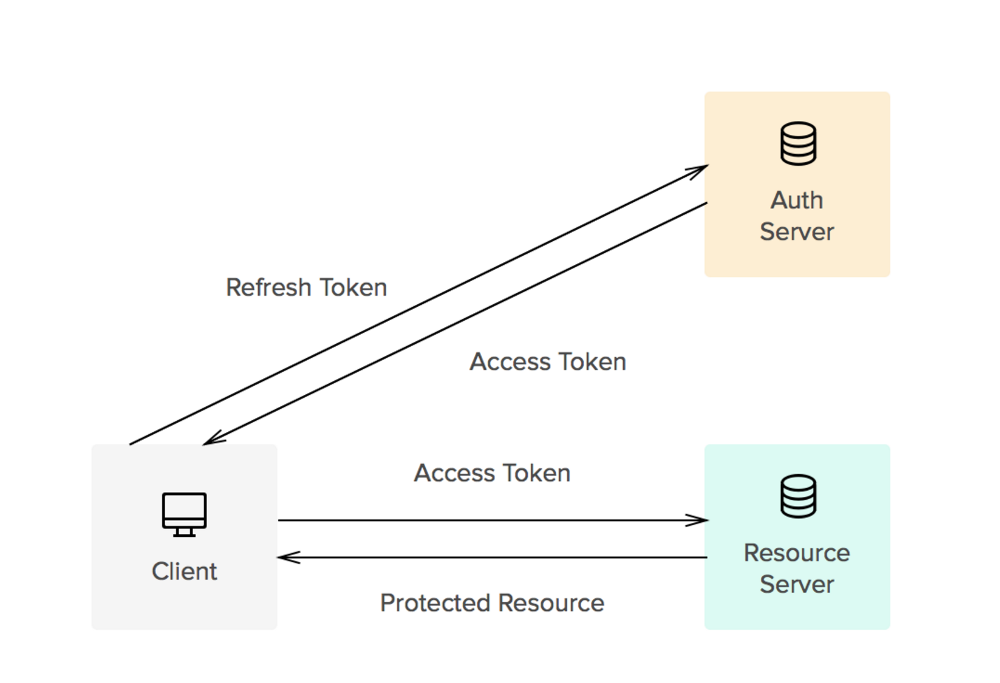

# 0001 - Authentication/User Management

## Context
Raster Foundry needs to support the following requirements regarding user authentication and registration:
 - Ability to support oAuth2, SSO, and other options for authentication beyond simple username/password
 - Basic user management is necessary (resetting passwords, deactivating users, grouping users into organizations)
 - Objects (layers, tools, users, etc.) may be limited in scope to users, organizations, roles within organizations.
 - Users should be able to generate client tokens to use for programmatic access that can be revoked

In the past the entire user management workflow was handled via the web framework we were using, `Django`. Extension of user registration was usually done on an ad-hoc basis, utilizing and extending third-party add-ons where we could. While we executed successfully in these cases, there were a few issues. First, some of the third-party add-ons we needed to rely on for additional integrations like SAML are underdeveloped and required either significant extensions or diving into the code because of a lack of documentation. Second, each new application required starting from almost scratch and the inclusion of additional services for basic functionality. For instance, user registration and password-management both required setting up email servers/services, asynchronous workers to send emails, and a broker to manage the asynchronous workers. A third problem we’ve experienced in the past is mixing authentication techniques provided by Django (e.g. using both sessions and tokens) which can create unintended difficulties in isolating authentication problems.

Another option in this case would be to use a third-party service that streamlines user management and registration. There are a few services that are mentioned often:

 - Stormpath
 - Auth0
 - Amazon Cognito

Each service has their own benefits and disadvantages.

### Documentation

Both [Stormpath](http://docs.stormpath.com/home/) and [Auth0](https://auth0.com/docs) have good documentation, with the slight edge going to Auth0. They have a number of SDKs, especially for both frontend and backend frameworks/languages. Stormpath’s documentation is slightly harder to navigate and Auth0’s starter applications and examples made putting together a simple application much easier.

Documentation for [Cognito](https://aws.amazon.com/documentation/cognito/) is fairly dense and difficult to determine how to use the service. Some of the terminology used in their documentation is unique to Amazon, whereas both Stormpath and Auth0 share a common language with much of the literature that already exists on token authentication and user management.

### Multi-Tenancy

Handling multiple tenants for Raster Foundry is a requirement. Both Stormpath and Auth0 have good documentation on how to handle this in their respective systems. Amazon Cognito does have documentation on this, but it isn't at all clear.

However, another option would be to continue to manage roles/levels in the database. We would still be able to leverage a service for managing users and passwords, but would also be able to more easily control database constraints over organizations and users. Storing organization and roles on user metadata in a service seems somewhat risky if the data in the service gets out of sync with the data modeled in the database.

### Third Party Integration

Both Stormpath and Auth0 have a fair amount of third-party integration that this is almost a draw -- for instance Google, Facebook, Twitter, etc. Auth0 also has a number of integrations with services that make it attractive, for instance it integrates well with Papertrail and will forward login/logout and other information to keep a log of events.

### Pricing

It is a little difficult to compare pricing amongst the services because they use different metrics to determine the price.

Auth0's [plans](https://auth0.com/pricing) are determined by the number of monthly active users and the set of features it provides. The free plan supports up to 7,000 active users with basic features that will satisfy requirements during development and possibly even during early phases of a released product. There are a few features that may influence our decision to switch to a paid plan:

 - more social login options (free plan is limited to two)
 - customized email templates

The basic plan starts at $12 a month for 1,000 active users, $29 for 2,500, $59 for 5,0000, and $190 for 10,000. Pricing does start to add up; however, because the pricing scales based on the number of users which should correlate with revenue it may not be as important.

Stormpath [pricing](https://stormpath.com/pricing) is based on the number of API calls and features. The free plan has less features than the Auth0 free plan and is limited to 10,000 API calls - or probably more relevant 7,0000 users signing on 1.4 times a month. The next plan is $49 a month with comparable features to the paid plan of Auth0 with 100,000 API calls or 5,000 users (closest Auth0 plan at the same price) signing on 20 times a month.

Amazon Cognito is by far the [cheapest](https://aws.amazon.com/cognito/pricing/), though only has a fraction of the features of Auth0 or Stormpath. Cognito is free up to 50,000 monthly users and $0.00550 for each additional user with further reduced pricing after 100,000 users.

## Decision

Raster Foundry will use a third-party service, Auth0, to manage users and authentication. The better documentation, SDKs, and third party integration suggest that it will reduce development time and provide a full set of login and user registration features for the application. Additionally, it provides the capability to write custom javascript code to execute during the authentication process.

In utilizing Auth0, two token types will be used:

 - access tokens: signed JSON Web Tokens (JWT) that will be used to authenticate requests to the API from a client application (web, native, etc.)
 - refresh tokens: these are long-lived, revokable, and user generated tokens for programmatic API access

### JSON Web Tokens (JWT)

This type of token (see [RFC](https://tools.ietf.org/html/rfc7519)) is a "compact, URL-safe means of representing claims to be transferred between two parties.  The claims in a JWT are encoded as a JSON object that is used as the payload of a JSON Web Signature (JWS) structure or as the plaintext of a JSON Web Encryption (JWE) structure, enabling the claims to be digitally signed or integrity protected with a Message Authentication Code (MAC) and/or encrypted." There are three parts to a JWT:

 - `Header` - description of type of token and algorithm used to sign it
 - `Body` - data that includes token issuer, user identifier, audience, expiration time, issue time, and any additional information we wish to include
 - `Signature` - HMAC signed with a shared secret and the data of the JWT

Verification of the JWT on the server is achieved via verifying the signature using a shared secret, which in some cases means that additional calls to the database are limited compared to traditional token authentication methods. Each time a JWT is used, as long it is properly signed and has not expired the server will extend the expiration time and resign it. Expiration times for JWT will need to be adjusted based on user activity so as not to log users out too soon. For instance, if 90 percent of users make an API call every 5 minutes and 99 percent make one at least every 15 minutes we would likely want to set the expiry a little longer than 15 minutes.

 
Depending on how we want to handle token revocation and/or forcing to login after a period of time there are a few options. We likely want to use an application level timeout for tokens so that they cannot be re-issued indefinitely. Additionally, if a user decides to reset their password or log out completely we may want to set a timestamp in the database to check the issue time against to ensure that tokens issued before that timestamp are not accepted.
 
### Refresh Tokens
 
Refresh tokens are opaque strings that can be used to get new JWT from Auth0. These are indefinite unless revoked and should be tied to a client application. These tokens will allow users to set up programmatic access with the application. It _will_ complicate our SDKs/Command Line Clients somewhat because the client will need to handle JWT expiration gracefully. The following diagram from Auth0 illustrates how their usage will operate.

## Consequences

Choosing to use Auth0 will have a few consequences. First, we will need to set up the front-end application to use Auth0 for all authentication and user sign-up. Second, we will need to use a library on our web server that can validate the signatures of JWT, of which there are many. Third, we will need to make a decision about where to encode user roles and organizations -- in the database and/or in Auth0. Lastly, we will need to come up with determination of the appropriate expiration time for our JWT.

There are some risks involved with adopting Auth0 to handle user management. The largest risk is that we decide that Auth0 is not an appropriate solution we will have to come up with a plan for exporting our users. Their support claims that they will provide an export of the users database if we request it, but do not yet have a self-service way to do so. The likelihood of us coming to the determination that we do not like Auth0 after we have significant users is low, but is still a possibility. Because there are only a few API calls involved, migrating to another provider like Stormpath does not seem prohibitive.
