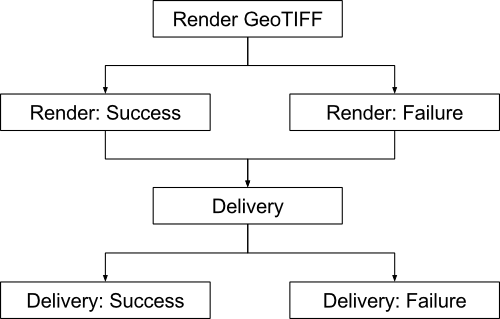

# Context

See [https://github.com/azavea/raster-foundry/issues/1253](https://github.com/azavea/raster-foundry/issues/1253) for feature requirements

We need to provide a way for users to request shipments or exports of imagery from our system in GeoTIFF and other formats, and we need to be able to deliver the finalized export to users.

We need to be able to deliver exports of large areas at high resolution, and we need to provide users with some indication of the progress of their requested exports.

At a very high level, no matter what architecture we choose, the workflow is probably going to look something like this:

1. User makes an export request via the API

2. Generate an export configuration based on the User's request

3. Render output (and report status)

4. Delivery (and report status)

## Imagery Handling and Sources

Imagery can come from several sources:

* A Project (collection of Scenes)

    * Users may select a subset of available Bands

    * Users may request RGB image output

* A Tool

    * NDVI

    * NDWI

    * EVI

* Either of the above, limited by an area-of-interest polygon

## Delivery

Imagery needs to be able to be delivered via:

* Rate-limited and metered HTTP link

* Direct deposit into user's S3 bucket

* Direct deposit into user's Dropbox

Users should be able to select the projection of the imagery which they will receive.

## Data Model

Choosing an appropriate internal data representation for exports and their parameters is important. Ideally, we would like to have a single export process that can handle exporting imagery from both Tool nodes and Projects, and we want this process to be easy to reason about, as well as resilient to changes in both Tools and Projects.

## User Needs

We don't have a lot of information about what actual usage patterns for this functionality will look like. Most of our beta users have 4-band (RGB+NIR) imagery. We do, however, know that many of our beta users have expressed a pressing need to be able to view their imagery on a map, and that exporting the results of analysis is less urgent for many of them.

# Decision

We will focus our immediate development efforts on providing a solution for users who want to export RGB imagery from Projects that already contain RGB bands, with little analysis or alteration aside from color correction and mosaicking. This approach will constrain the scope of development and allow us to iterate quickly on addressing a concrete problem faced by real users. 

Put another way, we are explicitly deferring implementation of export functionality for the following use cases:

* False-color composites

* Hyper-spectral or non-RGB data sources

* Projects whose Scenes don't all have the same available bands and resolution

* Tool outputs

* Arbitrary Tool nodes

However, we expect that we will need to cover these deferred cases sooner rather than later, so we will design our data model in a way that we believe will allow us to easily expand the export functionality going forward. More details on this design are given below.

Additionally, in order to avoid making decisions about functionality that we have limited information about, some further aspects of the functionality outlined above are not addressed in this ADR. These are noted at the end of the Decision section.

## Data model

Internally, we will wrap export configuration inside of *Tool* definitions, even though our initial focus will be on providing exports of RGB data from *Projects*. This means that if a user requests an export of a particular Project, without color-correction, we will internally generate a one-off Tool that looks something like the following:

We will then export the Output of that Tool. A Project that the user wanted to color-correct would have a color-correction operator in the middle instead of an Identity operator.

This approach will increase the initial complexity of developing the export process. Our work on specifying Tools and generating imagery from arbitrary Tool definitions is still in progress, and it will need to be finalized before this process can work, at least to the extent necessary to support this use case. Ultimately, we believe that adopting this architecture up-front will be a net win in terms of development effort, for the following reasons:

* It will force us to use our own functionality for Tools. This "dog-fooding" will provide us with an opportunity to discover problems and tricky areas in this functionality before our users do, which will make Tools more robust overall.

* It will let us get a head start on exporting Tools, making the eventual implementation of that functionality straightforward when we get to it. Ideally, we will be able to simply use a user-defined Tool definition for export rather than an internally-generated Tool, and everything should just work. It is unlikely that things will work out so perfectly in practice, but we will almost certainly save time.

* It will simplify the architecture of the export job, which will be able to assume that it will always receive a Tool definition as input and will not need to implement separate export logic depending on whether the user chooses to export a Project or a Tool.

## Workflow

### 1. User request

We will create an API endpoint that allows users to request an export of a Project. For this stage of development, this endpoint will need to accept (at minimum) parameters allowing the user to specify:

* The Project to export

* Delivery options (HTTP link, S3 deposit, Dropbox deposit)

* Area-of-interest geometry (used to mask the export output)

* Output projection SRID

The endpoint will need to prevent exports of Projects and Scenes that the user making the request is not authorized to access, and may also need to do basic verification of delivery options (does the user have S3 or Dropbox configured, is there enough space in their Dropbox, etc.).

### 2. Generate export configuration

The endpoint will need to convert the user's request into an internal representation for the export configuration, which will use the Tool-centric structure described above. This export configuration will be stored as a database record, which will trigger the creation of an Airflow DAG Run to perform the actual export. The Airflow Dag Run will be triggered similarly to the way that ingests are currently triggered: when a user makes an API request, a row will be written to an "export_configuration" table (the table name is not important) with a status signaling that it is pending or requires processing. An Airflow task will run periodically (every minute or two) to kick off Dag Runs for any export configuration that is marked as pending. It will then change those configurations' statuses so they don't get processed twice.

An outline of what an export configuration might look like is given at the end of the Decision section, but its exact schema is expected to change as we add functionality.

Note: Airflow 1.8 has an early version of a REST API that may allow us to trigger DAG Runs directly from the user-facing API endpoint, which would eliminate the need for a periodic task to scan for pending exports and thereby reduce latency. However, this feature is in its early stages, so we will wait until it is more mature before we utilize it.

### 3. Render output

This will be a Spark job will which take the export configuration (or relevant portions of it), render the necessary output, and store the result on S3. The details of how this job functions or where it should run are not defined here.

### 4. Delivery

Because the result of the export task will be stored on S3 in a consistent format, each delivery mechanism can be structured as a process that copies data from S3 and makes it available at a target. The three targets that we know of are: internal S3, accessible via HTTP, external S3, and DropBox. Internally, we will store this information in a database record so that users can have multiple AWS and DropBox credentials tied to their account. The authentication details to external accounts will need to be treated as sensitive information (that is, the same as passwords).

#### Internal S3

The delivery process will need to make the export result available via HTTP. This could be done in a number of ways, such as moving it to a specific S3 bucket or making a database record that links the export result with a publicly-accessible URL. This delivery option will also need to include rate-limiting and metering. The exact details of this functionality are left undefined for now.

#### External S3

The delivery process will require an S3 bucket and prefix where files should be stored, and AWS credentials to an external AWS account with sufficient permissions to write to that location. These parameters should be provided by the user. The delivery process will need to authenticate with the provided credentials, and then copy the result of the export process from our S3 into the provided bucket and prefix location.

#### DropBox

The delivery process will require credentials to a DropBox account, as well as a location within that DropBox. Functionality will be similar to the external S3 delivery mechanism: the delivery process will authenticate with the provided credentials and then attempt to copy the export results from our S3 to the provided DropBox account. Because DropBox accounts have limited storage, this delivery mechanism will need to pre-verify that enough space is available to store the export result, and will need to handle errors that may arise from a user's DropBox running out of space.

### 5. Status updates

We will need to provide the user with status updates about the progress of their export. Consistent with our existing status update mechanisms, we will express this as an enumeration of statuses on the export records in the database. This enumeration is expected to look something like the following (subject to change):

* PENDING

    * The export needs to have an Airflow DAG kicked off for it.

* SUBMITTED

    * The export has a DAG but has not been processed further.

* RENDERING

    * The export is being rendered.

* DELIVERING

    * The export has been rendered and is being delivered.

* SUCCESS

    * The export has been delivered successfully and is complete.

* ERROR

    * The export has encountered an error and has failed to complete.

We will structure status updates as separate Airflow tasks wherever possible. This is because update mechanisms that are too tightly coupled to the task they report on can often be brought down with it when it fails, causing incorrect reporting. By keeping the status tasks separate from the tasks which do the "real" work, we can ensure that reporting is based on Airflow's view of task status, which we expect to be most often correct. An example DAG structure is given below:

## Sample Export Configuration Schema

This schema omits common fields such as user and creation date/time. This is intended as a starting point; changes are expected.

*ExportConfiguration*

* source: FK Tool

    * This could also be stored as a JSON field that represents a Tool definition.

* output_projection: SRID

* mask: MultiPolygon

    * Area of interest to clip the result to.

* delivery_config: FK DeliveryConfig

    * Users will create these objects by providing us with credentials for S3, DropBox, etc.

* status: Enum

    * PENDING

    * SUBMITTED

    * RENDERING

    * DELIVERING

    * SUCCESS

    * ERROR

* result: JSON

    * Link if delivery_config.type == HTTP

    * Error message if status == FAILURE

## Deferred Decisions

Decisions about structure for the following features are left undefined until we gather more information about usage and desired functionality:

* Rate limiting and metering for downloads

    * We don't know how much detail is necessary and this could carry high engineering costs depending on the solution chosen.

* User interface for allowing users to select different bands for export, false-color composites

    * This is not anticipated to be a priority of our early users and we don't have enough information about the use cases here to develop a clear path forward for implementing this in the backend.

* Handling for Projects that contain Scenes with different sets of bands and/or different resolutions.

    * Same as previous.

# Consequences

Wrapping all exports inside of Tools is likely to require greater upfront development effort than exporting Projects directly would have. However, as described above, we believe that this approach will pay significant dividends in terms of development effort and robustness later.

Storing status updates in an enumeration makes it more difficult for us to store extra metadata about export status, and it prevents us from storing fine-grained statuses such as percent completion. It is simpler to implement, however, and more flexible solutions are also more complex. We believe the simplicity of an enumeration-based solution will make it straightforward for us to extend the status update functionality once a concrete use case arises.

Because this is a complex feature being developed largely without direct user feedback (so far), we have deferred architecting a number of aspects of this functionality until we gather more real-world usage information. This reduces the risk that we will expend development resources on features that users don't need. By deferring implementation, we expose ourselves to the possibility that we may have to develop these features under time pressure at some point in the future, but this is balanced by the fact that if such a situation does occur, we will have a much clearer understanding of the necessary functionality at that point than we do now.

