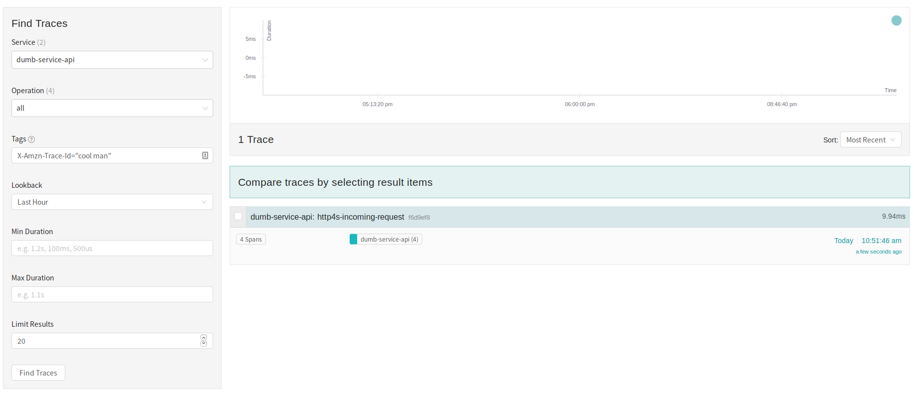

# Context

Our tile servers are under constant load. When errors are thrown, we tend to log useful information,
but the background noise volume is high enough that it's difficult to look at logs and see what was
going on with a particular request. Separately, it would be nice to have some metrics for functions
and api calls used for a request -> response transformation. The constant load makes it almost
impossible to gather useful information outside of a highly controlled and constrained environment.
This difficulty masks issues that only become visible in production.

There are a few approaches to tracing and dumping metrics that we could use, but we don't know
anything about any of them.  Some of the libraries available in the scala ecosystem include
[`natchez`](https://github.com/tpolecat/natchez), [`http4s-tracer`](https://github.com/profunktor/http4s-tracer),
and [`scala-opentracing`](https://github.com/Colisweb/scala-opentracing). Eventually, we will want to be able to dump traces to an external source, like [Jaeger](https://www.jaegertracing.io/),
[AWS X-Ray](https://aws.amazon.com/xray/), or [Honeycomb](https://www.honeycomb.io/).

We'd like to assess how difficult it would be to:

- get started with a logging implementation
- eventually hook into one of these external services

## The Contenders

I considered the following tracing libraries, presented in the order in which I
tried them out. Each of them is seemingly maintained by one person, so there's
considerable risk that development will stop someday at random on each of them.

### `natchez`

Natchez promises nice integration with things that we already use from the
TypeLevel ecosystem, or at least it would, if I could figure out how to provide
a `ConcurrentEffect` for `Kleisli[F, Span[F], ?]`. The reasons that's hard are:

- I'm having trouble figuring out how to construct a `new ConcurrentEffect[F]`,
not just for this particular evidence, but in general. When I try to implement
a `runCancelable`, I get a warning about `runCancelable` being unused,
despite that appearing to be the method definition that [I'm supposed to care
about](https://github.com/typelevel/cats-effect/blob/master/core/shared/src/main/scala/cats/effect/ConcurrentEffect.scala#L42-L61).
- The most obvious workaround is suggested by
the `EitherT` concurrent (or `WriterT`, or take your
pick), but the trait I'd need (`KleisliConcurrent`) is [private to
`cats-effect`](https://github.com/typelevel/cats-effect/blob/master/core/shared/src/main/scala/cats/effect/Concurrent.scala#L749).
- Moreover, the [`natchez`
example](https://github.com/tpolecat/natchez/blob/master/modules/examples/src/main/scala/Example.scala)
has no idea about being a webservice -- it only knows how to ask a database for
some information. The extra typeclass requirements from `BlazeServerBuilder`
are a bit challenging to resolve.

Rob Norris currently recommends not to use `natchez` in
anything you need to work, and I think we should take his
[advice](https://github.com/tpolecat/natchez/blame/efcefbf28c88ab977206df0f394d4141b3c5b2ca/README.md#L60).

The (broken) implementation I wound up with is on
[`feature/js/natchez`](https://github.com/jisantuc/tracing-demos/tree/feature/js/natchez).

### `scala-opentracing`

`scala-opentracing` ties its language very closely to the [Open Tracing
specification](https://opentracing.io/specification/). It's a library used by
Colisweb in production according to its readme. In summary, wherever you want
to trace, you'll need a `TracingContextBuilder[F]` for your effect type. The
only off-the-shelf non-trivial one is for DataDog. I don't know if there's a
way to get a local copy of the DataDog service running (I don't think there
is), so I pretended to have a fancier implementation that was really just
wrapping a `new TracingContextBuilder[IO]` around `LoggingTracingContext[IO]`,
since the `LoggingTracingContext` doesn't provide the implicit that I need. It
was fairly easy to set up the dependency, with the exception of adding
a repository to my resolvers (so we'd need to add that to Nexus in a few
places as well). We could start with the `LoggingTracingContext` very easily.

The out-of-the-box logging tracer [doesn't print or store tags
anywhere](https://github.com/Colisweb/scala-opentracing/blob/e9563d6da8d921e1d4c25178ffb5131e047bd9b0/src/main/scala/com/colisweb/tracing/LoggingTracingContext.scala#L18),
which is unfortunate, but I don't think it would be hard
to roll our own, since it's an 86-line Scala file. If
we want integration with a non-DataDog sink, I _think_
it's the case that we can provide a `Tracer` from `io.opentracing` to the
[`OpenTracingContext`](https://github.com/Colisweb/scala-opentracing/blob/e9563d6da8d921e1d4c25178ffb5131e047bd9b0/src/main/scala/com/colisweb/tracing/OpenTracingContext.scala)
class and wrap it the same way I wrapped the `LoggingTracingContext`.

Because it looked the most promising, we worked on two extensions to the basic implementation.
The first involved building a custom trace ID based on the incoming request and logging that instead
of the randomly generated trace ID that `scala-opentracing`'s `LoggingTracerContext` will
create on its own. That commit was added to the initial implementation [here](https://github.com/jisantuc/tracing-demos/tree/cd8b5b7aa33d35d9f57837451a93b4bdceb96417),
and worked fine.

The second extension involved setting up Jaeger as a destination instead of just logging. It's similar,
I think, to how any OpenTracing compliant destination will work, though the particular methods for
configuration will probably vary by target. That commit is available [here](https://github.com/jisantuc/tracing-demos/tree/e8986e32da61b0a4d01c688fa2f5c2ca5a432f6f). There's one scala warning if you compile from that point
about how `idGenerator` is unused. I left it in to highlight that the `OpenTracingContext` doesn't let
you choose how to generate trace IDs. However, the Jaeger UI will let you search by tags. Changes to use
Jaeger and include `X-Amzn-Trace-Id` in the trace tags are [here](https://github.com/jisantuc/tracing-demos/tree/fa931325c55286290cebb64b6753186363f2b999).
That search interface looks like this:

The initial implementation I wound up with is on
[`feature/js/scala-opentracing`](https://github.com/jisantuc/tracing-demos/tree/f02408d4942c14eec84dd676199056e8e1b99add).

### `http4s-tracer`

`http4s-tracer` is oriented around atagless final
implementation of tracing. It requires a tracing algebra to
be present in a lot of different places. In examples at least,
it requires you to include the tracing activity everywhere.  What
that means in practice is that you don't have as much tracing logic [_around_
things](https://github.com/jisantuc/tracing-demos/blob/feature/js/scala-opentracing/app-backend/api/src/main/scala/com/jisantuc/tracingdemos/InterpreterService.scala#L27-L29)
as you do [within
things](https://http4s-tracer.profunktor.dev/guide.html#traced-programs),
so your tracing has to be less of an afterthought. It's probable that that
encourages better design and thinking about monitoring and instrumentation
when the code is written. It makes showing a toy example with with only a
single place to do computation sort of challenging.

Something that appears to be missing is the notion of a "span", which was
central in `natchez` and `scala-opentracing` and also in the Open Tracing spec.
There also doesn't seem to be any notion of tagging the traces with key-value
pairs, which is also central in the Open Tracing spec. While it would probably
meet our current needs to have a log-only trace ID, we've already done a less
fancy version of that with the incoming trace IDs from AWS. Given that "we
will want to be able to dump traces", I think the absence of out-of-the-box
support is concerning, especially given the comparatively high degree of
difficulty for implementing new tracing behaviors.

I didn't implement tracing in the demos repository for `http4s-tracer`.

# Decision

We should use `scala-opentracing` for our initial implementation of tracing. There
are several reasons why this is the case. The general risk in each of these libraries
is that they're maintained seemingly by a single person. However, in `scala-opentracing`'s
case, we at least know that the person maintaining it is responsible for the health of
a production system. It's not super challenging to get started with `scala-opentracing`.
I was able to get the logging tracer up and running in under two hours. Chris was able
to make substantive changes to it in order to extract a header from the API under 90
minutes after he started looking at this ADR. I was later able to configure dumping
traces to Jaeger instead of just logging without considerable difficulty.

Those are all very different from the experiences with the other two libraries. `natchez`
is advertised as not quite ready for production, and even "hook it into `http4s`" is a
hard problem right now. There's some [ongoing work](https://github.com/tpolecat/natchez/issues/5)
on that front that looks close to done, but it's also been ongoing for two months, and there's
no timeline. `http4s-tracer` uses a separate vocabulary from what's used in the
Open Tracing spec and doesn't have an API for writing traces to external services.

# Consequences

We'll need to add `scala-opentracing` to backsplash. This is fairly easy. Getting
the tracer configured will also be fairly easy as long as we're just doing a logging
tracer to start. There's some infra work necessary once we want to add third party
service.

We'll need to choose a repository for our traces. We'd like that to be X-Ray, since
it means we don't have to configure and deploy another service, but that may not be
an option. We can also decide that we should just log for a while, since even that
would be useful. For reference, changes necessary to add Jaeger as a repository
for local development are in
[this pr](https://github.com/jisantuc/tracing-demos/pull/1/files).

We'll need to figure out what we want to trace. We could, for example, make all of
the color correction and mosaic implicits functions take implicit trace contexts.
I believe it's the case that if we had, e.g., Jaeger as the repository, we could
set up the sampler to only send traces on one percent of requests, which would mean
we could deploy some really aggressive tracing and pay whatever price we pay for
tracing on one tile in every three or so map loads. If that's true, we should trace
aggressively. If it's not, we should trace conservatively.
